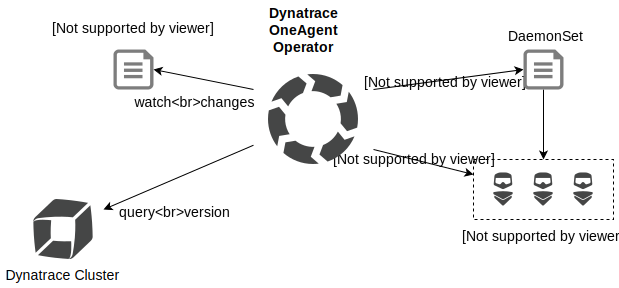

# Dynatrace OneAgent Operator Helm Chart

This is the home of the Dynatrace OneAgent Operator's Helm Chart which supports the rollout and lifecycle of [Dynatrace OneAgent](https://www.dynatrace.com/support/help/get-started/introduction/what-is-oneagent/) in Kubernetes and OpenShift clusters.
Rolling out Dynatrace OneAgent via DaemonSet on a cluster is straightforward.
Maintaining its lifecycle places a burden on the operational team.
Dynatrace OneAgent Operator closes this gap by automating the repetitive steps involved in keeping Dynatrace OneAgent at its latest desired version.

## Overview

Dynatrace OneAgent Operator is based on [Operator SDK](https://github.com/operator-framework/operator-sdk) and uses its framework for interacting with Kubernetes and OpenShift environments.
It watches custom resources `OneAgent` and monitors the desired state constantly.
The rollout of the Dynatrace OneAgent is managed by a DaemonSet initially.
From here on the Dynatrace OneAgent Operator controls the lifecycle and keeps track of new versions and triggers updates if required.
The Dynatrace OneAgent Operator's Helm Chart will also roll out the actual OneAgent automatically during installation.




## Supported platforms

Depending of the version of the Dynatrace OneAgent Operator, it supports the following platforms:

| Dynatrace OneAgent Operator Helm Chart version | Kubernetes | OpenShift Container Platform |
| ---------------------------------------------- | ---------- | ---------------------------- |
| v0.6.0                                         | 1.11+      | 3.11+                        |
| v0.5.4                                         | 1.11+      | 3.11+                        |


## Quick Start

The Dynatrace OneAgent Operator acts on its separate namespace `dynatrace`.
It holds the operator deployment and all dependent objects like permissions, custom resources and
corresponding DaemonSets.
To install the Dynatrace OneAgent Operator via Helm run the following command:

### Adding Dynatrace OneAgent Helm repository
```
$ helm repo add dynatrace https://raw.githubusercontent.com/Dynatrace/helm-charts/master/repos/stable
```

### Prepare tokens

Generate an API and a PaaS token in your Dynatrace environment.

https://www.dynatrace.com/support/help/reference/dynatrace-concepts/why-do-i-need-an-environment-id/#create-user-generated-access-tokens

To install the Dynatrace OneAgent Operator replace the APIUrl, the API token and the PaaS token in command and execute it

#### Kubernetes
```
$ kubectl create namespace dynatrace
$ helm install dynatrace-oneagent-operator dynatrace/dynatrace-oneagent-operator -n dynatrace --set platform="kubernetes",oneagent.apiUrl="https://ENVIRONMENTID.live.dynatrace.com/api",secret.apiToken="DYNATRACE_API_TOKEN",secret.paasToken="PLATFORM_AS_A_SERVICE_TOKEN"
```

#### OpenShift
```
$ oc adm new-project --node-selector="" dynatrace
$ helm install dynatrace-oneagent-operator dynatrace/dynatrace-oneagent-operator -n dynatrace --set platform="openshift",oneagent.apiUrl="https://ENVIRONMENTID.live.dynatrace.com/api",secret.apiToken="DYNATRACE_API_TOKEN",secret.paasToken="PLATFORM_AS_A_SERVICE_TOKEN"
```

This will automatically install the Dynatrace OneAgent Operator and create OneAgents for every of your nodes.

## Update procedure

To update simply update your helm repositories and check the latest version

```
$ helm repo update
```

You can then check for the latest version by searching your Helm repositories for the Dynatrace OneAgent Operator

```
$ helm search repo dynatrace-oneagent-operator
```

To then update to the latest version run this command and do not forget to add the `reuse-values` flag to keep your configuration

```
$ helm upgrade dynatrace-oneagent-operator dynatrace/dynatrace-oneagent-operator -n dynatrace --reuse-values
```

## Uninstall dynatrace-oneagent-operator
Remove OneAgent custom resources and clean-up all remaining OneAgent Operator specific objects:


```sh
$ helm uninstall dynatrace-oneagent-operator -n dynatrace
```

## License

Dynatrace OneAgent Operator Helm Chart is under Apache 2.0 license. See [LICENSE](../LICENSE) for details.
