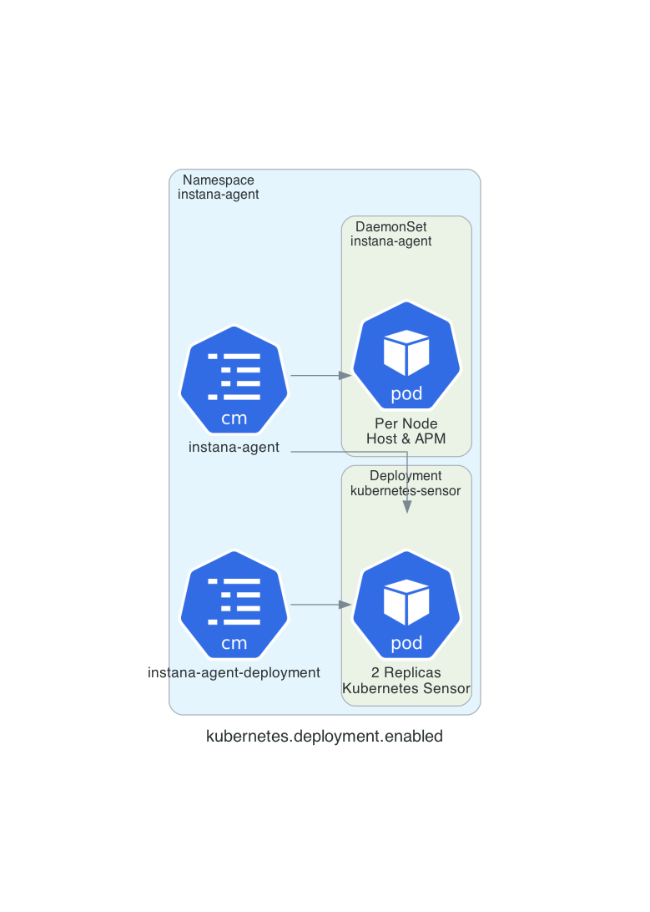

# Kubernetes Deployment Mode (tech preview)

Instana has always endeavored to make the experience of using Instana as seamless as possible from auto-instrumentation to one-liner installs. To date for our customers with Kubernetes clusters containing more than 1,000 entities this wasn’t the case. The Kubernetes sensor as a deployment is one of many steps we’re taking to improve the experience of operating Instana in Kubernetes. This is a tech preview however we have a high degree of confidence it will work well in your production workloads. The fundamental change moves the Kubernetes sensor from the DaemonSet responsible for monitoring your hosts and processes into its own dedicated Deployment where it does not contend for resources with other sensors. An overview of this deployment is below:



This change provides a few primary benefits including:

* Lower load on the Kubernetes api-server as it eliminates per node pod monitoring.
* Lower load on the Kubernetes api-server as it reduces the endpoint watch to 2 leader elector side cars.
* Lower memory and CPU requests in the DaemonSet as it is no longer responsible for monitoring Kubernetes.
* Elimination of the leader elector sidecar in the DaemonSet as it is only required for the Kubernetes sensor.
* Better performance of the Kubernetes sensor as it is isolated from other sensors and does not contend for CPU and memory.
* Better scaling behaviour as you can adjust the memory and CPU requirements to monitor your clusters without overprovisioning utilisation cluster wide.

The primary drawback of this model in the tech preview include:

* Reduced control and observability of the Kubernetes specific Agents in the Agent dashboard.
* Some unnecessary features are still enabled in the Kubernetes sensor (e.g. trace sinks, and host monitoring).

Some limitations remain unchanged from the previous sensor:

* Clusters with a high number of entities (e.g. pods, deployments, etc) are likely to have non-deterministic behaviour due to limitations we impose on message sizes. This is unlikely to be experienced in clusters with fewer than 500 hosts.
* The ServiceAccount is shared between both the DaemonSet and Deployment meaning no change in the security posture. We plan to add an additional service account to limit access to the api-server to only the Kubernetes sensor Deployment.

## Installation

For clusters with minimal controls you can install the tech preview with the following Helm install command:

```
helm template instana-agent \
    --repo https://agents.instana.io/helm \
    --namespace instana-agent \
    --create-namespace \
    --set agent.key=${AGENT_KEY} \
    --set agent.endpointHost=${BACKEND_URL} \
    --set agent.endpointPort=443 \
    --set cluster.name=${CLUSTER_NAME} \
    --set zone.name=${ZONE_NAME} \
    --set kubernetes.deployment.enabled=true \
    instana-agent
```

If your cluster employs Pod Security Policies you will need the following additional flag:

```
--set podSecurityPolicy.enable=true
```

If you are deploying into an OpenShift 4.x cluster you will need the following additional flag:

```
--set openshift=true
```
