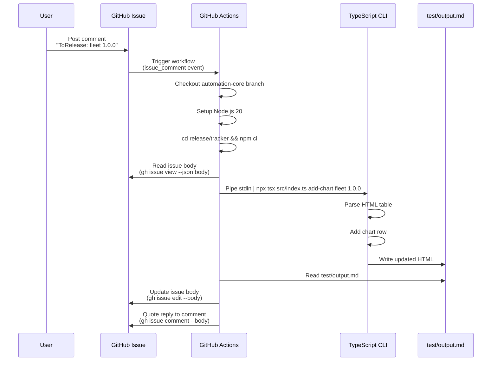
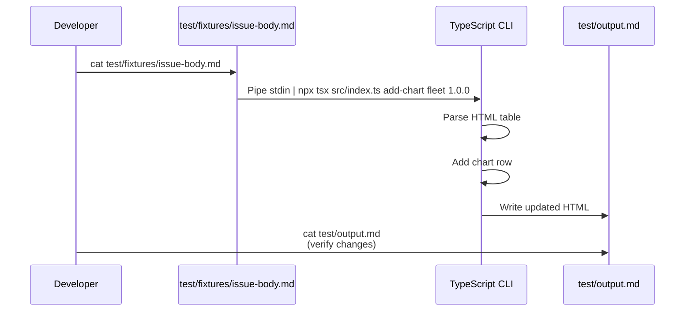
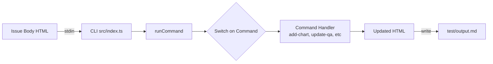

# Release Tracker System

GitHub-native monthly release tracking via HTML tables in issues, updated by comment-driven automation.

---

## Architecture Flow

### Production Flow (GitHub Actions)



### Development Flow (Local Testing)



---

## Data Flow



---

## File Structure

```
release/tracker/
├── src/
│   ├── index.ts              # CLI entry point (stdin → test/output.md)
│   ├── parser.ts             # Cheerio HTML utilities
│   └── commands/             # Command implementations (add-chart, update-qa, etc)
│                             # errors.ts, validation.ts
├── test/
│   ├── fixtures/             # Static test input files
│   ├── unit/                 # Unit tests per command
│   ├── integration/          # Full workflow tests
│   └── output.md             # Generated output (gitignored)
├── package.json
└── tsconfig.json
```

---

## Key Design Decisions

### Why test/output.md (not stdout)?

**Problem:** console.log debug statements pollute stdout
**Solution:** Write to file, logs go to GHA console

**Benefits:**
- Debug logs visible in GHA runs
- Same path in dev and production
- Easy to inspect on failure
- Matches test infrastructure

### Why stdin (not --input flag)?

**Reason:** GitHub CLI outputs JSON to stdout
**Usage:** `gh issue view 123 --json body -q .body | npx tsx ...`

### Why HTML table (not markdown)?

**Reason:** Data attributes enable machine parsing
**Example:**
```html
<tr data-chart="fleet" data-version="1.0.0" data-qa="true">
  <td class="chart">fleet</td>
  <td class="qa">yes</td>
</tr>
```

Cheerio can find rows via `$('tr[data-chart="fleet"][data-version="1.0.0"]')`

---

## Error Handling

### Centralized Error Messages (errors.ts)

All errors are **user-facing** (displayed in GHA comment replies), not developer debug output.

**Architecture:** Factory functions in `src/commands/errors.ts`

```typescript
export const Errors = {
  chartNotFound: (chart: string, version: string) => `Chart "${chart}" version "${version}" is not in the release table.

Check the chart name and version are correct.
If you made a typo in your comment, please post a new comment with the correct values.`,

  tableNotFound: () => `Could not find release tracking table.
This issue may not be set up correctly.

Please contact @rancher/release-team`,
};
```

**Why this approach:**

1. **User-facing by design:** Errors explain what happened + how to fix, no technical jargon
2. **Consistency:** All commands share error messages (e.g., `tableNotFound` used by all)
3. **Maintainability:** Single place to update wording, affects all commands
4. **Testability:** Tests import `Errors.chartNotFound('x', '1.0')` and validate exact message
5. **Type-safe params:** `chartNotFound(chart: string, version: string)` prevents missing values

**Example:**
```typescript
// Command code
if (row.length === 0) {
  throw new Error(Errors.chartNotFound(options.chart, options.version));
}

// Test code
assert.strictEqual(err.message, Errors.chartNotFound('fleet', '1.0.0'));
```

